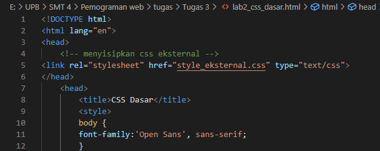
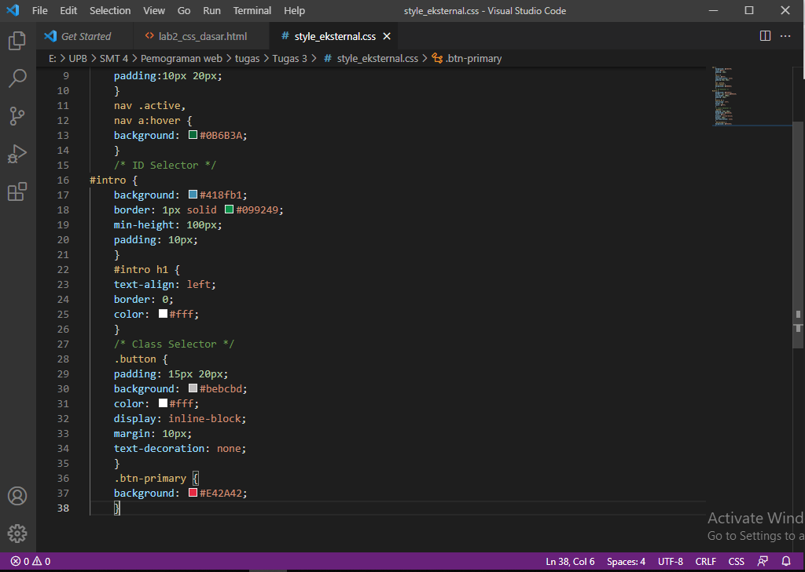

# Lab2Web
## Praktikum 2 : CSS Dasar

### Membuat dokumen HTML
Buatlah dokumen HTML seperti berikut.

Selanjutnya buka pada browser untuk melihat hasilnya.

### Mendeklarasi CSS Internal
Kemudian tambahkan deklarasi CSS internal seperti berikut pada bagian head dokumen.

Selanjutnya simpan perubahan yang ada, dan lakukan refresh pada browser untuk melihat
hasilnya.

### Menambahkan Inline CSS
Kemudian tambahkan deklarasi inline CSS pada tag 
 seperti berikut.

Simpan kembali dan refresh kembali browser untuk melihat perubahannya.

### Membuat CSS Eksternal
Buatlah file baru dengan nama style_eksternal.css kemudian buatlah deklarasi CSS seperti berikut.

Kemudian tambahkan tag <link> untuk merujuk file css yang sudah dibuat pada bagian <head>

Selanjutnya refresh kembali browser untuk melihat perubahannya.

### Menambahkan CSS Selector
Selanjutnya menambahkan CSS Selector menggunakan ID dan Class Selector. Pada file
style_eksternal.css, tambahkan kode berikut.

Kemudian simpan kembali dan refresh browser untuk melihat perubahannya.

